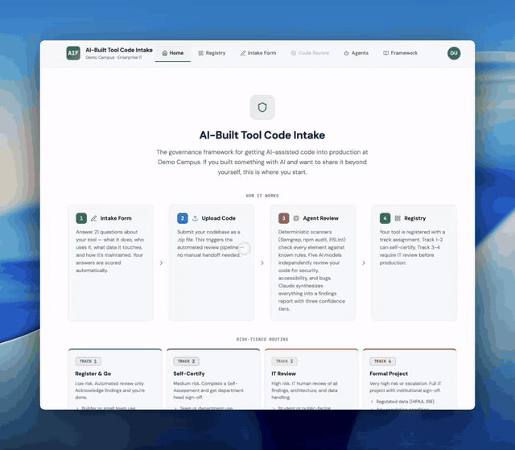

<p align="center">
  
</p>

<p align="center">
  
</p>

<p align="center">
  <strong>Risk-tiered governance for AI-assisted tools at scale</strong><br/>
  Score risk across 7 dimensions, route to the right review track, and run a uniform<br/>
  5-model agent pipeline that produces structured findings no human could replicate alone.<br/><br/>
  <a href="https://aif.zachrossmiller.com">AIF Demo</a>
</p>

<p align="center">
  
  
  
  
</p>

---

<p align="center">
  
</p>

---

## The Problem

Universities are drowning in AI-built tools. Faculty spin up chatbots, students ship dashboards with FERPA data, departments deploy scripts that talk to third-party APIs with no DPA. Nobody knows what's running, what data it touches, or who's responsible when it breaks.

Traditional IT governance doesn't fit: a faculty member's internal grading helper shouldn't require the same review as a student-facing AI that handles HIPAA data. But ignoring it isn't an option either.

**AIF is proportional governance.** Low-risk tools register and go. High-risk tools get formal review. Everything in between gets exactly the scrutiny its risk profile demands — scored automatically, analyzed by five independent AI models, and documented for compliance.

The portal is the enforcement layer: builders submit tools via a 21-question intake form, the system scores them on seven weighted dimensions, routes them to a Track (1-4), runs a uniform 5-model agent pipeline, and produces structured reports with auto-generated documentation. Reviewers approve or request changes; admins manage users and audit activity.

Built by the CIO's office at the University of Montana. Designed for portability to other institutions.

---

## How It Works

```
Submit tool  -->  Score 7 dimensions  -->  Route to Track  -->  5-model pipeline  -->  Review
```

1. **Intake**: Builder answers 21 questions about the tool — what it does, who uses it, what data it touches, how it authenticates, whether users know it's AI
2. **Scoring**: Seven dimensions scored 0-3, weighted by artifact type (public site, internal app, AI agent, etc.), producing a risk percentage
3. **Track routing**: Risk percentage maps to a governance track. Nine escalation conditions can force Track 4 regardless of score
4. **Agent pipeline**: Five independent AI models analyze the codebase using the same prompt. Deterministic tools (Semgrep, ESLint, npm audit) run in parallel. Claude synthesizes everything with dispute resolution
5. **Review**: Track 1 auto-activates. Track 2 lets builders self-certify. Tracks 3-4 require reviewer approval. All decisions are audit-logged

---

## Scoring Model

### 7 Weighted Dimensions (0-3 each)

| Dimension | What It Measures |
|-----------|-----------------|
| **Security** | Secrets, auth, input validation, dependencies, encryption |
| **Accessibility** | Semantic HTML, ARIA, keyboard, contrast |
| **Data Sensitivity** | No data through HIPAA/FERPA/export-controlled |
| **Blast Radius** | Builder only through institution-wide exposure |
| **Autonomy** | Fully manual through autonomous decisions |
| **Comprehension** | Builder understands fully through can't explain AI code |
| **Maintenance** | Test coverage, docs, dependency freshness, error handling |

### Weight Profiles by Artifact Type

Each artifact type has a different weight profile. A public website weights accessibility and security heavily; an AI agent weights autonomy and blast radius.

| Artifact Type | SEC | A11Y | DATA | BLAST | AUTO | COMP | MAINT |
|--------------|-----|------|------|-------|------|------|-------|
| Public Site | 4 | 4 | 3 | 3 | 1 | 2 | 3 |
| Internal App | 3 | 3 | 4 | 2 | 1 | 2 | 3 |
| Script/API | 3 | 0 | 3 | 2 | 2 | 2 | 3 |
| AI Agent | 3 | 1 | 3 | 4 | 4 | 4 | 3 |
| Data Pipeline | 3 | 0 | 4 | 2 | 2 | 2 | 3 |
| Other | 3 | 2 | 3 | 2 | 1 | 2 | 3 |

**Weighted % = Sum(score x weight) / (3 x Sum(weight)) x 100**

### Track Routing

| Weighted % | Track | What Happens |
|------------|-------|-------------|
| < 22% | **Track 1 — Register & Go** | Register in institutional registry. Auto-activates on pipeline completion. |
| 22-42% | **Track 2 — Self-Certify** | Builder reviews pipeline findings, signs off. |
| 42-65% | **Track 3 — IT Review** | Reviewer examines findings, approves or requests changes. |
| >= 65% | **Track 4 — Formal Project** | Formal IT project governance with full review cycle. |

### Escalation Conditions

Nine conditions force Track 4 regardless of weighted percentage:

1. Regulated data (HIPAA/IRB/export-controlled/tribal) present
2. FERPA data in a public-facing tool: unauthenticated, or authenticated without campus SSO
3. Institutional data in personal accounts
4. AI model without approved DPA
5. Authentication outside campus SSO
6. No version control
7. Students unaware they're interacting with AI
8. Payment card data (PCI DSS)
9. Autonomous decisions without human review

FERPA behind campus SSO on an internet-reachable deployment doesn't escalate to Track 4 — it applies a Track 3 floor instead, guaranteeing IT review without forcing formal-project governance on every SSO-protected campus web app.

---

## Agent Pipeline

### Two-Layer Architecture

AI models are good at reasoning about architecture, intent, and context. They're bad at exhaustive mechanical checking — verifying that every `<input>` has a `<label>`, that every dependency is free of known CVEs, that no file contains a SQL injection pattern.

The pipeline exploits both strengths:

- **Layer 0 — Deterministic Tooling**: SAST scanners, linters, and dependency auditors that mechanically check every element against known rule sets. High precision, exhaustive coverage, zero hallucination. Runs in parallel with model passes — no added latency.
- **Layer 1 — Multi-Model AI**: Five AI models reason about what tools can't — business logic flaws, architecture concerns, auth flow correctness, and "does this actually make sense?" judgment calls. Claude synthesizes with filesystem access for dispute resolution.

Three confidence tiers in output:

| Tier | Source | Meaning |
|------|--------|---------|
| **Tool-Verified** | Semgrep, ESLint, npm audit | Deterministic scanner with known rule match |
| **Confirmed** | 3+ AI models agree | Independent convergence — high confidence |
| **Potential** | 1-2 models flagged | Needs human review |

### Layer 0: Deterministic Tools

| Tool | Agent | What It Checks |
|------|-------|---------------|
| [Semgrep](https://github.com/semgrep/semgrep) | 1 | OWASP Top 10 + default SAST rules (SQLi, XSS, command injection) |
| npm audit / pip-audit | 1 | Known dependency CVEs against advisory databases |
| [Snyk Agent Scan](https://github.com/snyk/snyk-agent-scan) | 1 | MCP config and SKILL.md security threats |
| [eslint-plugin-jsx-a11y](https://github.com/jsx-eslint/eslint-plugin-jsx-a11y) | 2 | Static React/JSX accessibility (34 rules: alt text, labels, ARIA, keyboard) |
| ESLint QA | 3 | Dead code, unused variables, unreachable code, async bugs, type safety |

### Layer 1: Multi-Model Convergence

Five different AI models receive the **same prompt** and independently analyze the entire codebase. No model reviews its own work. Claude only synthesizes — it never runs a pass.

| Pass | Model | Method | Why This Model |
|------|-------|--------|----------------|
| 1 | GPT-5.4 | Codex CLI (filesystem access) | Structured reasoning, logical vulnerability detection |
| 2 | MiniMax M2.5 | Direct OpenRouter API | Large-context reasoning, cross-file analysis |
| 3 | MiMo-V2-Flash | Direct OpenRouter API | Fast reasoning model, code optimization |
| 4 | Kimi K2 | Direct OpenRouter API | 1T MoE architecture, edge case detection |
| 5 | GLM-5 | Direct OpenRouter API | Agent-optimized, deep code understanding |
| Synthesis | Claude Opus 4.6 | Claude Code CLI (filesystem access) | Dispute resolution with full codebase access |

Pass 1 (Codex) has full filesystem access and explores the codebase autonomously. Passes 2-5 receive a pre-bundled codebase (deterministic file selection, 400K char budget) with structured JSON output enforcement. Synthesis uses Claude Code CLI so it can read source files to resolve disputes.

### The Four Agents

| Agent | Type | What It Does |
|-------|------|-------------|
| **1: Code & Security** | 5 models + synthesis + stack deep dive | 10-section security rubric. Integrated tools: Semgrep, npm audit, Snyk. Second Claude pass runs framework-specific checklists (React, Express, Django, etc.) |
| **2: Accessibility** | 5 models + synthesis | WCAG 2.2 Level AA audit across every component, template, and stylesheet. Integrated tool: eslint-plugin-jsx-a11y |
| **3: QA / Bug Detection** | 5 models + synthesis | Logic bugs, error handling, async/concurrency, edge cases, type safety. Reads Agent 1+2 output for context. Integrated tool: ESLint QA |
| **4: Documentation + HECVAT** | 3 parallel passes (Gemini + GLM-5 + Claude) | Generates User Guide, Admin Guide, Compliance Summary (.docx via Pandoc). HECVAT 4.15 self-assessment (87 questions, official XLSX template) |

All tracks run all agents. The pipeline is uniform — track determines governance requirements, not analysis depth.

---

## Features

### Intake & Scoring
- **21-question form** with live scoring sidebar showing dimension scores and track assignment as you answer
- **localStorage auto-save** (5s debounce) + server draft auto-save (60s) with recovery prompt on return
- **Progress bar** with field validation hints and focus-to-first-error on submit
- **6 artifact types** with distinct weight profiles driving proportional governance

### Pipeline
- **SSE live streaming** of agent progress, pass completions, and CLI output in real time
- **Cancel button** with AbortController propagation to all child processes (SIGTERM + SIGKILL fallback)
- **Retry** with dead letter queue (max 2 total attempts before permanent failure)
- **Per-model timeouts** tuned to observed performance (Codex 15min, MiniMax 8min, etc.)
- **Partial results synthesis** — synthesis proceeds with whatever passes completed (minimum 1 of 5); such runs are flagged partial_analysis and Track 1 auto-activation is blocked for them
- **Pass metrics** recorded per-pass: timing, JSON parse status, output size, error category

### Reports & Findings
- **Structured findings** with severity, file:line evidence, and confidence tier (tool-verified / confirmed / potential)
- **7-dimension scores** with weighted percentage and track recommendation
- **Tabbed agent results** — Code & Security, Accessibility, QA, Documentation
- **Findings review** — triage findings as open/resolved/won't fix with debounced persistence
- **File tree view** — browse findings organized by source file
- **HECVAT 4.15 XLSX** — official EDUCAUSE template pre-filled (~65% of 87 questions answerable from code analysis)
- **Document export** — User Guide, Admin Guide, Compliance Summary as .docx

### Review Workflow
- **Track-appropriate governance** — Track 1 auto-activates, Track 2 self-certifies, Track 3-4 requires reviewer
- **Approve / request changes** with comment thread
- **Track override** — reviewers/admins can escalate or de-escalate with documented reason
- **Sandbox mode** — builder-only visibility until ready for review

### Admin
- **Dashboard** — submission stats, active pipelines, review queue depth
- **Pipeline analytics** — per-model performance (avg/median/max timing, success rate, parse failures), cost tracking, daily/weekly trends
- **User management** — role assignment, activation/deactivation
- **Audit log** — every status change, review decision, and admin action with actor, timestamp, and IP
- **Data retention** — configurable cleanup (pass results 90d, notifications 30d, audit log report-only)

### Portal
- **Dark mode** — instant theme switching via `[data-theme="dark"]` CSS selectors
- **WCAG 2.2 AA** — 4.5:1 contrast ratios, keyboard navigation, ARIA labels, focus indicators
- **In-app + email notifications** — pipeline completion, review needed, status changes, per-user preferences
- **Pluggable SSO** — CAS, header-based (Shibboleth), OIDC/SAML stubs. Set `AUTH_PROVIDER` env var.
- **Institution portability** — `INSTITUTION_NAME`, `INSTITUTION_DOMAIN`, `AUTH_PROVIDER` env vars, one config to switch

---

## Tech Stack

| Layer | Technology |
|-------|-----------|
| **Frontend** | React 19 + Vite, CSS design system (light + dark mode), WCAG 2.2 AA, lucide-react icons |
| **Backend** | Node.js (ESM), Express 4, raw SQL with pg, Zod request validation |
| **Database** | PostgreSQL 16 (Alpine), 14 migrations, performance indexes |
| **Auth** | Pluggable SSO (CAS, header, OIDC/SAML stubs), JWT cookies (jose), RBAC |
| **Security** | Helmet CSP/HSTS, CSRF double-submit cookie, rate limiting, non-root Docker |
| **AI Pipeline** | Codex CLI (GPT-5.4) + 4 models via OpenRouter direct API + Claude Code CLI (synthesis) |
| **Deterministic Tools** | Semgrep (SAST), npm/pip audit (CVEs), Snyk (MCP security), ESLint (a11y + QA) |
| **Documents** | Pandoc (Markdown to .docx), xlsx (HECVAT template export) |
| **Deployment** | Docker Compose (2 containers: app + postgres), multi-stage build, health checks |

---

## Architecture

```
                        +-----------------+
                        |    Browser      |
                        |  React + Vite   |
                        +--------+--------+
                                 |
                        +--------+--------+
                        |  Nginx Proxy    |
                        |  (reverse proxy)|
                        +--------+--------+
                                 |
                    +------------+------------+
                    |                         |
           +--------+--------+      +--------+--------+
           |   Express API    |      |  Agent Pipeline  |
           |   /auth          |      |                  |
           |   /intake        |      |  Codex CLI       |
           |   /registry      |      |  OpenRouter API  |
           |   /pipeline      |      |  Claude Code CLI |
           |   /review        |      |  Semgrep         |
           |   /reports       |      |  ESLint          |
           |   /admin         |      |  npm audit       |
           |   /analytics     |      |  Snyk            |
           +--------+--------+      +--------+--------+
                    |                         |
                    +------------+------------+
                                 |
                    +------------+------------+
                    |                         |
           +--------+--------+      +--------+--------+
           |   PostgreSQL     |      |   File System    |
           |   16-alpine      |      |   /data/output   |
           |   14 migrations  |      |   /data/codebases|
           +-----------------+      +-----------------+
```

### Request Flow

```
Browser  --->  Nginx  --->  Express (JWT verify + RBAC)  --->  Route handler
                                      |
                                      +---> PostgreSQL (data)
                                      +---> Pipeline queue (SSE streaming)
                                               |
                                               +---> Agent 1 (5 models + tools + synthesis)
                                               +---> Agent 2 (5 models + tools + synthesis)
                                               +---> Agent 3 (5 models + tools + synthesis)
                                               +---> Agent 4 (3 parallel passes)
                                               |
                                               +---> Results to DB + filesystem
```

---

## Project Structure

```
AIF/
├── docker-compose.yml                  # App + PostgreSQL (2 containers)
├── Dockerfile                          # Multi-stage build (frontend + backend + CLI tools)
├── hecvat415.xlsx                      # HECVAT 4.15 official template
├── backend/
│   ├── migrations/                     # 14 SQL migrations
│   ├── .env.example                    # All env vars documented
│   └── src/
│       ├── server.js                   # Express API (helmet, CSRF, rate limiting, routes)
│       ├── index.js                    # CLI entry point (node src/index.js <path> [track])
│       ├── config.js                   # Institution-specific configuration
│       ├── scoring.js                  # 7-dimension scoring engine (weights, tracks, escalations)
│       ├── validation.js               # Zod schemas for all state-changing routes
│       ├── logger.js                   # Structured JSON logger with child contexts
│       ├── audit.js                    # Audit log writer
│       ├── notifications.js            # In-app + email notification delivery
│       ├── auth/
│       │   ├── middleware.js            # JWT verification, requireRole(), requireOwnerOrRole()
│       │   ├── jwt.js                   # Token signing + verification (jose)
│       │   └── providers/              # Pluggable SSO providers
│       │       ├── index.js             # Provider loader (reads AUTH_PROVIDER env)
│       │       ├── cas.js               # CAS SSO
│       │       ├── header.js            # Reverse proxy auth (Shibboleth/mod_shib)
│       │       ├── bypass.js            # Dev mode auto-auth
│       │       ├── oidc.js              # OpenID Connect / Entra ID (stub)
│       │       └── saml.js              # SAML 2.0 (stub)
│       ├── db/
│       │   ├── pool.js                  # PostgreSQL pool + withTransaction() helper
│       │   └── migrate.js              # Auto-migration runner
│       ├── pipeline/
│       │   ├── queue.js                 # Job queue, SSE streaming, cancel/retry, metrics
│       │   └── events.js               # SSE event emitter
│       ├── orchestrator/
│       │   └── direct-api.js            # Pipeline orchestration (5 models + tools + synthesis)
│       ├── agents/
│       │   ├── shared/
│       │   │   ├── cli.js               # CLI execution, JSON extraction, env filtering, timeouts
│       │   │   ├── direct-api.js        # OpenRouter API with structured JSON enforcement
│       │   │   └── codebase-bundle.js   # Deterministic file selection (400K char budget)
│       │   ├── code-analysis/           # Agent 1: prompts, schema, semgrep, dep-audit
│       │   ├── accessibility/           # Agent 2: prompts, schema, jsx-a11y linter
│       │   ├── qa-analysis/             # Agent 3: prompts, schema, eslint-qa
│       │   └── documentation/           # Agent 4: prompts, hecvat-prompt, xlsx-export
│       ├── routes/                      # 9 route files + 4 test files (271 tests)
│       ├── jobs/retention.js            # Data retention (pass_results, notifications, audit)
│       ├── providers/                   # LLM provider config + smoke test
│       └── utils/extract.js             # Archive extraction with path traversal protection
├── frontend/
│   ├── vite.config.js
│   └── src/
│       ├── App.jsx                      # Root shell, hash routing, role guards
│       ├── constants.js                 # Scoring preview, color palette, display metadata
│       ├── api.js                       # API client (auth, intake, pipeline, review, admin)
│       ├── styles.css                   # CSS design system (light + dark themes)
│       ├── hooks/                       # useAuth, useHashRouter, useSSE
│       └── components/                  # 18 components (one per file)
│           ├── IntakeForm.jsx           # 21-question form, live scoring, auto-save
│           ├── CodeUpload.jsx           # Upload + pipeline streaming
│           ├── FindingsReview.jsx       # Findings triage (open/resolved/won't fix)
│           ├── AdminDashboard.jsx       # Tabbed admin (stats, analytics, users, audit)
│           ├── AgentsPage.jsx           # Pipeline architecture + model rationale
│           ├── FrameworkDoc.jsx         # 12-section framework reference with TOC
│           └── ...                      # Registry, ToolDetail, ReviewPanel, Report, etc.
└── um-standards/                        # UM AI compliance references (gitignored)
```

---

## Documentation

Full reference documentation lives in [`docs/`](docs/README.md). Quick links:

| Section | Audience | Start with |
|---------|----------|-----------|
| [Getting Started](docs/getting-started/) | New installers | [Installation](docs/getting-started/installation.md) |
| [User Guide](docs/user-guide/) | Builders + Reviewers | [Overview](docs/user-guide/overview.md) |
| [Admin Guide](docs/admin-guide/) | System admins | [Overview](docs/admin-guide/overview.md) |
| [Architecture](docs/architecture/) | Engineers | [Overview](docs/architecture/overview.md) |
| [API Reference](docs/api/) | Integrators | [Overview](docs/api/overview.md) |
| [Framework](docs/framework/) | Policy / compliance | [Scoring model](docs/framework/scoring-model.md) |
| [Development](docs/development/) | Contributors | [Setup](docs/development/setup.md) |
| [Institutional Adoption](docs/institutional-adoption/) | Other institutions | [Porting](docs/institutional-adoption/porting.md) |

---

## Quick Start

### Prerequisites

- Docker & Docker Compose
- API keys for the agent pipeline:
  - `OPENAI_API_KEY` — OpenAI direct (Codex CLI, pass 1)
  - `OPENROUTER_API_KEY` — MiniMax, MiMo, Kimi, GLM (passes 2-5)
  - `ANTHROPIC_API_KEY` — Claude Code CLI (synthesis)

### Setup

```bash
# Clone
git clone <repo-url>
cd AIF

# Configure
cp backend/.env.example backend/.env
# Edit backend/.env — fill in API keys, JWT_SECRET, DB_PASSWORD

# Launch
docker compose up -d

# Access at http://localhost:3300/aif/
# Default AUTH_PROVIDER=bypass for local dev (no SSO required)
```

Both containers (app + postgres) start with health checks. Migrations run automatically on startup.

### Development

```bash
# Backend (with file watching)
cd backend && npm install && npm run dev

# Frontend (separate terminal, with HMR)
cd frontend && npm install && npm run dev

# Run tests
cd backend && npm test    # 271 tests
```

### CLI (pipeline only, no portal)

```bash
cd backend
node src/index.js /path/to/codebase             # Default: Track 3
node src/index.js /path/to/codebase TRACK_1     # Register & Go
node src/index.js /path/to/codebase TRACK_4     # Formal Project
```

### Environment Variables

```bash
# === Pipeline (required) ===
OPENAI_API_KEY=sk-...                # Codex CLI (pass 1)
OPENROUTER_API_KEY=sk-or-...         # MiniMax + MiMo + Kimi + GLM (passes 2-5)
ANTHROPIC_API_KEY=sk-ant-...         # Claude Code CLI (synthesis)
SNYK_TOKEN=...                       # Snyk agent-scan (optional)

# === Database ===
DATABASE_URL=postgresql://aif:pw@db:5432/aif
DB_PASSWORD=changeme

# === Auth ===
AUTH_PROVIDER=bypass                 # cas | oidc | saml | header | bypass
JWT_SECRET=...                       # generate: node -e "console.log(require('crypto').randomBytes(32).toString('hex'))"
ADMIN_NETIDS=                        # comma-separated usernames for auto-admin

# --- CAS (AUTH_PROVIDER=cas) ---
CAS_BASE_URL=https://login.example.edu/cas
CAS_SERVICE_URL=https://your-domain.edu/aif/api/auth/callback

# --- Header / Shibboleth (AUTH_PROVIDER=header) ---
# AUTH_HEADER_USER=REMOTE_USER
# AUTH_HEADER_DISPLAY_NAME=displayName

# --- OIDC / Entra (AUTH_PROVIDER=oidc) — stub, not yet implemented ---
# OIDC_ISSUER=https://login.microsoftonline.com/{tenant}/v2.0
# OIDC_CLIENT_ID=
# OIDC_CLIENT_SECRET=
# OIDC_REDIRECT_URI=https://your-domain.edu/aif/api/auth/callback

# --- SAML (AUTH_PROVIDER=saml) — stub, not yet implemented ---
# SAML_ENTRY_POINT=https://idp.example.edu/idp/profile/SAML2/Redirect/SSO
# SAML_ISSUER=aif-portal
# SAML_CERT=
# SAML_CALLBACK_URL=https://your-domain.edu/aif/api/auth/callback

# === Institution ===
INSTITUTION_NAME=Your Institution
INSTITUTION_DOMAIN=example.edu
FRONTEND_URL=https://your-domain.edu/aif/

# === Email (optional) ===
SMTP_HOST=smtp.example.edu
SMTP_PORT=25
SMTP_FROM=noreply-aif@example.edu
```

---

## Security

| Control | Implementation |
|---------|---------------|
| **Auth** | Pluggable SSO providers (`AUTH_PROVIDER`), JWT cookies (jose), role-based access |
| **CSRF** | Double-submit cookie pattern (x-csrf-token header) |
| **Headers** | Helmet — CSP, HSTS, X-Frame-Options, X-Content-Type-Options, Referrer-Policy |
| **Rate Limiting** | 30/15min auth, 120/min API |
| **Input Validation** | Zod schemas on all state-changing routes, 1MB body limit, query param sanitization |
| **Subprocess Isolation** | `filteredEnv()` — each CLI tool receives only its own API key + HOME/PATH/NODE_ENV |
| **Shell Safety** | `execFileSync` (array args, no shell) for all archive extraction and git operations |
| **URL Validation** | HTTPS required, shell metacharacter rejection, optional hostname allowlist |
| **Path Traversal** | All extracted archive files validated to stay within target directory |
| **Container** | Non-root `aif` user, resource limits (8GB/4CPU app, 1GB db), log rotation |
| **Audit** | Every status change, review decision, and admin action logged with actor + IP |

---

## Testing

```bash
cd backend && npm test
```

271 tests across 5 test files, using Node's built-in test runner (no external framework):

- **scoring.test.js** — dimension scores, weighted percentages, track routing boundaries, escalation conditions, frontend/backend weight matrix parity
- **registry.test.js** — status state machine (valid/invalid transitions, role restrictions, exhaustive TRANSITIONS map)
- **review.test.js** — review validation schemas, review-specific state transitions, self-certify constraints
- **pipeline.test.js** — pipeline run schema validation, URL validation (HTTPS, shell metacharacters), model cost sanity, retry constants
- **intake.test.js** — intake validation, draft lifecycle, score computation edge cases

---

## Portability

AIF is built for the University of Montana but designed to port. To deploy at another institution:

1. **Set institution identity**: `INSTITUTION_NAME`, `INSTITUTION_DOMAIN`
2. **Configure SSO**: Set `AUTH_PROVIDER` to your SSO type and fill in the provider-specific env vars:
   - `cas` — set `CAS_BASE_URL`, `CAS_SERVICE_URL`
   - `header` — set `AUTH_HEADER_USER` (for Shibboleth/mod_shib reverse proxy)
   - `oidc` — set `OIDC_ISSUER`, `OIDC_CLIENT_ID`, `OIDC_CLIENT_SECRET`, `OIDC_REDIRECT_URI` (planned)
   - `saml` — set `SAML_ENTRY_POINT`, `SAML_ISSUER`, `SAML_CERT` (planned)
   - `bypass` — no config needed (dev mode only)
3. **Set admin users**: `ADMIN_NETIDS=user1,user2` — these users get admin role on first login
4. **Configure email** (optional): `SMTP_HOST`, `SMTP_PORT`, `SMTP_FROM`
5. **Deploy**: `docker compose up -d` — everything else is self-contained

The framework document (`um-ai-built-tool-intake.docx`) and scoring model are institution-agnostic. The 21 intake questions, 7 dimensions, weight profiles, and escalation conditions encode general higher-ed AI governance principles, not UM-specific policy.

---

## Standards & Inspirations

### Framework Standards
- [NIST AI RMF](https://www.nist.gov/artificial-intelligence/risk-management-framework) — AI risk management framework
- [NIST CSF 2.0](https://www.nist.gov/cyberframework) — Cybersecurity framework
- [WCAG 2.2](https://www.w3.org/WAI/standards-guidelines/wcag/) — Web content accessibility guidelines
- [OWASP Top 10](https://owasp.org/www-project-top-ten/) — Web application security risks
- [EDUCAUSE HECVAT](https://library.educause.edu/resources/2020/4/higher-education-community-vendor-assessment-toolkit) — Higher ed vendor assessment
- [ITIL 4](https://www.axelos.com/certifications/itil-service-management) — IT service management

### Agent Inspirations
- **Agent 1**: [Shannon](https://github.com/KeygraphHQ/shannon), [Semgrep](https://github.com/semgrep/semgrep), [TruffleHog](https://github.com/trufflesecurity/trufflehog), [Scorecard](https://github.com/ossf/scorecard), [Bearer](https://github.com/Bearer/bearer), [Snyk](https://github.com/snyk/snyk-agent-scan)
- **Agent 2**: [accessibility-agents](https://github.com/Community-Access/accessibility-agents), [ai-agent-a11y-reviewer](https://github.com/guillempuche/ai-agent-a11y-accessibility-reviewer), [axe-core](https://github.com/dequelabs/axe-core), [Pa11y](https://github.com/pa11y/pa11y)
- **Agent 3**: SonarQube, ESLint, TypeScript (pattern inspiration)
- **Agent 4**: [ai-doc-gen](https://github.com/divar-ir/ai-doc-gen), [readme-ai](https://github.com/eli64s/readme-ai), EDUCAUSE HECVAT 4.15

### CLI Tools
- [Codex](https://github.com/openai/codex) (OpenAI) — GPT-5.4 with filesystem access
- [Claude Code](https://github.com/anthropics/claude-code) (Anthropic) — Claude with filesystem access

---

<p align="center">
  University of Montana · Office of the CIO · Enterprise IT · 2026
</p>
